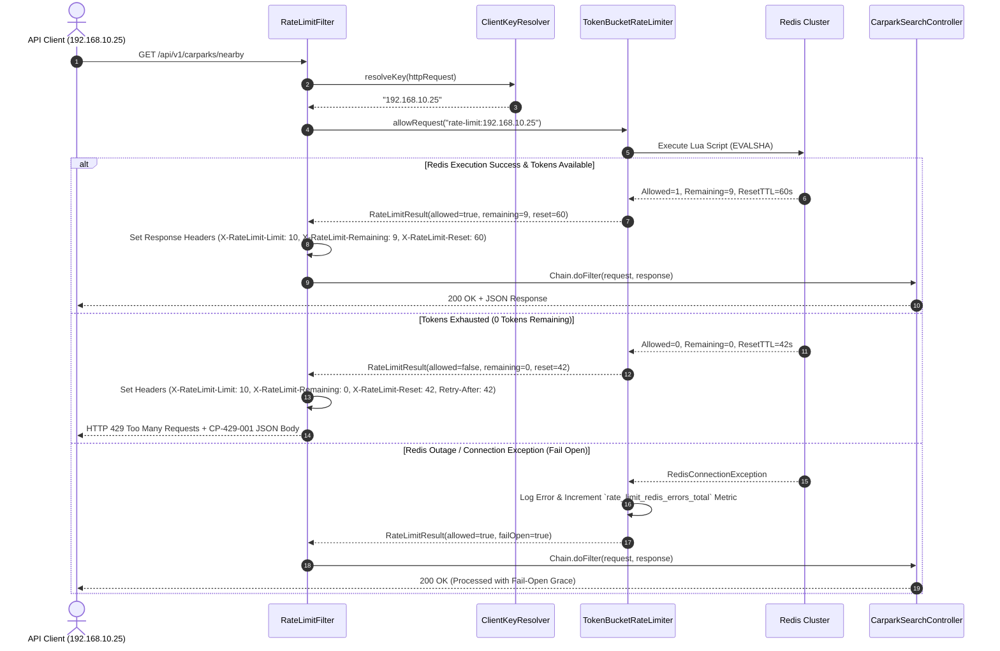

# Software Engineer Technical Requirements & Agile User Stories
## Project: Singapore Nearby Parking Availability API (`ParkingAvailabilitySystem`)

---

## 1. Executive Summary & Problem Overview

### 1.1 Objective
The goal of this project is to design and implement a production-grade, resilient, API-only Java backend application that helps drivers in Singapore find available car parks near a specified location.

### 1.2 Core Capabilities
1. **Static Dataset Ingestion**: Load carpark metadata (locations, addresses, coordinate mapping) from the Singapore Data.gov.sg static dataset.
2. **Live Availability Synchronization**: Periodically fetch, parse, and store real-time carpark availability from the Singapore Data.gov.sg Live Carpark Availability API.
3. **Proximity Search & Spatial Queries**: Expose a RESTful API that accepts user GPS coordinates (latitude/longitude), calculates distances, filters out carparks with zero available lots, sorts by proximity, and returns ranked results efficiently.
4. **Resilience & Fault Tolerance**: Gracefully handle external API slowness, rate-limiting, network partitions, or stale data downstreams, ensuring zero downtime and transparent freshness reporting.
5. **AI Governance & Trade-off Reflection**: Maintain explicit documentation (`DESIGN.md` and `AI.md`) detailing architectural choices, trade-offs, edge-case handlings, and AI pair-programming transparency.

---

## 2. Data Architecture & Domain Analysis

### 2.1 Data Sources & Mappings

| Aspect | Static Dataset (Carpark Info) | Live Availability API |
| :--- | :--- | :--- |
| **Source URL** | `https://data.gov.sg/api/action/datastore_search` | `https://api.data.gov.sg/v1/transport/carpark-availability` |
| **Format** | JSON | JSON |
| **Primary Key** | `car_park_no` (e.g. `"HE12"`, `"ACB"`) | `carpark_number` (e.g. `"HE12"`, `"ACB"`) |
| **Spatial Reference** | SVY21 projected coordinates (`x_coord`, `y_coord` in meters) | N/A |
| **Key Fields** | `car_park_no`, `address`, `x_coord`, `y_coord`, `car_park_type`, `type_of_parking_system`, `short_term_parking`, `free_parking`, `night_parking`, `car_park_decks`, `gantry_height`, `car_park_basement` | `carpark_number`, `carpark_info` (`total_lots`, `lots_available`, `lot_type`), `update_datetime` |

### 2.2 Coordinate Transformation Specification (SVY21 -> WGS84)
- **Challenge**: The static dataset uses **SVY21** (EPSG:3414), Singapore's national grid coordinate system based on Transverse Mercator projection (Easting `x_coord` and Northing `y_coord` in meters). Users and GPS systems use **WGS84** (EPSG:4326 - Latitude/Longitude in decimal degrees).
- **Transformation Rationale**: Coordinates must be transformed upon static dataset ingestion so that all spatial indexing and distance queries operate on standard WGS84 coordinates (Latitude ~1.2° to 1.5° N, Longitude ~103.6° to 104.0° E).
- **Implementation Strategy**:
  - Use `proj4j` (or mathematical Transverse Mercator transformation formulas calibrated for Singapore projection origin `Latitude 1° 22' 00" N`, `Longitude 103° 50' 00" E`, False Easting 28001.642m, False Northing 38744.572m).
  - Pre-convert and cache transformed `latitude` and `longitude` in the persistence layer during startup/seed execution.

### 2.3 PostgreSQL Database Schema, Spatial Indexing & Hyperscale (Billions/Trillions) Sharding Architecture

To support sub-millisecond proximity queries today and seamlessly scale to **billions/trillions of rows** (handling millions of carparks globally and years of minute-by-minute time-series availability snapshots), the database architecture separates static geospatial metadata, real-time hot state, and cold historical audit logs into distinct storage engines and partitioning strategies.

```
+-----------------------------------------------------------------------------------+
|                              PostgreSQL / PostGIS Cluster                         |
+-----------------------------------------------------------------------------------+
|                                                                                   |
|  1. Static Metadata Table [carparks]                                              |
|     - PostGIS Geography (Point, 4326)                                             |
|     - Spatial GiST / SP-GiST Index                                                |
|                                                                                   |
|  2. Real-Time Hot State [carpark_current_availability]                            |
|     - Fast In-Memory / Partial Index (WHERE lots_available > 0)                   |
|     - Sharded by carpark_number (Co-located with carparks)                        |
|                                                                                   |
|  3. Time-Series Cold Data [carpark_availability_history]                          |
|     - Declarative Monthly/Daily Range Partitions                                  |
|     - BRIN Indexing on update_datetime (Ultra-lightweight footprint)              |
|     - Columnar Compression / Archival via Foreign Data Wrappers (S3/Parquet)       |
+-----------------------------------------------------------------------------------+
```

#### 2.3.1 DDL Schema Definition (PostgreSQL + PostGIS)

```sql
-- Enable PostGIS Extension for native geospatial indexing
CREATE EXTENSION IF NOT EXISTS postgis;
CREATE EXTENSION IF NOT EXISTS btree_gist;

-- 1. Static Carpark Location Metadata Table
CREATE TABLE carparks (
    carpark_number          VARCHAR(32) PRIMARY KEY,
    address                 TEXT NOT NULL,
    x_coord                 NUMERIC(12, 4) NOT NULL, -- SVY21 Easting
    y_coord                 NUMERIC(12, 4) NOT NULL, -- SVY21 Northing
    latitude                NUMERIC(10, 7) NOT NULL, -- WGS84 Latitude
    longitude               NUMERIC(10, 7) NOT NULL, -- WGS84 Longitude
    location                GEOGRAPHY(Point, 4326) NOT NULL, -- Spatial Geography Column
    car_park_type           VARCHAR(64),
    type_of_parking_system  VARCHAR(64),
    short_term_parking      VARCHAR(64),
    free_parking            VARCHAR(64),
    night_parking           VARCHAR(16),
    car_park_decks          INT DEFAULT 0,
    gantry_height           NUMERIC(4, 2) DEFAULT 0.0,
    car_park_basement       VARCHAR(8),
    created_at              TIMESTAMPTZ DEFAULT CURRENT_TIMESTAMP,
    updated_at              TIMESTAMPTZ DEFAULT CURRENT_TIMESTAMP
);

-- Spatial GiST Index for fast proximity search (ST_DWithin, ST_Distance)
CREATE INDEX idx_carparks_spatial_gist ON carparks USING GIST (location);

-- B-Tree Index on transformed lat/lng for non-PostGIS fallback queries
CREATE INDEX idx_carparks_lat_lng ON carparks (latitude, longitude);


-- 2. Real-Time Hot Availability Table (Latest State per Carpark)
CREATE TABLE carpark_current_availability (
    carpark_number          VARCHAR(32) PRIMARY KEY REFERENCES carparks(carpark_number) ON DELETE CASCADE,
    total_lots              INT NOT NULL CHECK (total_lots >= 0),
    lots_available          INT NOT NULL CHECK (lots_available >= 0),
    lot_type                VARCHAR(10) NOT NULL DEFAULT 'C', -- C: Car, Y: Motorcycle, H: Heavy Vehicle
    update_datetime         TIMESTAMPTZ NOT NULL,
    is_stale                BOOLEAN NOT NULL DEFAULT FALSE,
    updated_at              TIMESTAMPTZ DEFAULT CURRENT_TIMESTAMP
);

-- Partial Index: Fast filtering for carparks with AVAILABLE lots only (drastically cuts index size)
CREATE INDEX idx_current_avail_positive ON carpark_current_availability (carpark_number, lots_available)
WHERE lots_available > 0;

-- Composite B-Tree Index for rapid joins & freshness checks
CREATE INDEX idx_current_avail_lookup ON carpark_current_availability (carpark_number, lots_available, is_stale);


-- 3. Time-Series Availability History Table (Scale to Billions/Trillions of Snapshot Rows)
CREATE TABLE carpark_availability_history (
    id                      BIGSERIAL,
    carpark_number          VARCHAR(32) NOT NULL,
    total_lots              INT NOT NULL,
    lots_available          INT NOT NULL,
    lot_type                VARCHAR(10) NOT NULL,
    update_datetime         TIMESTAMPTZ NOT NULL,
    created_at              TIMESTAMPTZ DEFAULT CURRENT_TIMESTAMP,
    PRIMARY KEY (id, update_datetime)
) PARTITION BY RANGE (update_datetime);

-- Example Partition Creation (Monthly partitions created via pg_partman or automated job)
CREATE TABLE carpark_availability_history_2026_08 PARTITION OF carpark_availability_history
    FOR VALUES FROM ('2026-08-01 00:00:00+00') TO ('2026-09-01 00:00:00+00');

-- BRIN (Block Range Index) on update_datetime: 99% smaller than B-Tree, ideal for append-only time series
CREATE INDEX idx_history_brin_time ON carpark_availability_history USING BRIN (update_datetime);

-- B-Tree Composite Index per partition for carpark history lookups
CREATE INDEX idx_history_carpark_time ON carpark_availability_history (carpark_number, update_datetime DESC);
```

#### 2.3.2 Indexing & Query Execution Strategy

For a proximity query (`lat = 1.3521`, `lng = 103.8198`, `radius = 1.0km`):
```sql
SELECT 
    c.carpark_number,
    c.address,
    c.latitude,
    c.longitude,
    a.total_lots,
    a.lots_available,
    a.lot_type,
    a.update_datetime,
    a.is_stale,
    ST_Distance(c.location, ST_MakePoint($2, $1)::geography) AS distance_meters
FROM carparks c
INNER JOIN carpark_current_availability a ON c.carpark_number = a.carpark_number
WHERE a.lots_available > 0
  AND ST_DWithin(c.location, ST_MakePoint($2, $1)::geography, $3) -- $3 = radius in meters (1000m)
ORDER BY distance_meters ASC
LIMIT $4 OFFSET $5;
```
* **Performance Guarantee**: `ST_DWithin` leverages the `GiST` index to narrow down candidates in $\mathcal{O}(\log N)$ time before evaluating distances. Joining with `carpark_current_availability` hits the in-memory partial index (`WHERE lots_available > 0`), delivering sub-10ms response times even over millions of static carparks.

#### 2.3.3 Multi-Terabyte / Trillion-Row Sharding & Partitioning Strategy (Citus / Multi-Node Architecture)

When scaling to **global cities** (hundreds of millions of carparks and trillions of time-series records):

1. **Table Distribution Key (Citus / Distributed PostgreSQL)**:
   - **Distributed Table**: `carparks` and `carpark_current_availability` are sharded across database worker nodes using `carpark_number` or **H3 Spatial Cell Index** (Uber H3 spatial grid) as the distribution key.
   - **Co-location**: Both tables share the same shard key so that geospatial + availability `JOIN` operations execute locally on each shard without cross-node network traffic.

2. **Geographic Hash-based Partitioning**:
   - Level 1 (API Gateway / Geo-Routing Proxy): User coordinates mapped to Geohash / H3 index, routing request to regional database shards (e.g. `sg-shard-01`, `us-east-shard-02`).
   - Level 2 (Node Level): Partition pruning evaluates local PostGIS GiST index.

3. **Time-Series Cold Storage & Tiering**:
   - **Hot Tier (0-7 days)**: PostgreSQL memory/NVMe storage for active availability lookups and recent history partitions.
   - **Warm Tier (8-90 days)**: Partitioned PostgreSQL tables using BRIN indexing and LZ4 table compression (`ALTER TABLE ... SET (toast_tuple_target = 128)`).
   - **Cold Tier (> 90 days - Trillions scale)**: Detached partitions exported to Parquet format on Object Storage (S3 / GCS) queried via DuckDB / PostgreSQL Foreign Data Wrapper (`postgres_fdw` / `parquet_s3_fdw`).

#### 2.3.4 10 km Spatial Range Indexing, Geohash Bounding & Anomaly Resolution

At a **10 km search radius** (e.g. `radius_km = 10.0`), a spatial search in a dense urban environment (like Singapore, which spans roughly $50 \times 27\text{ km}$) covers a significant geographic area ($\approx 314.15\text{ km}^2$), potentially encompassing 500 to 1,500 carparks. Standard un-indexed scans or naive distance calculations slow down dramatically under high concurrency.

##### 1. Indexing Optimizations for 10 km Searches:
- **Spatial R-Tree (GiST / SP-GiST)**: PostGIS `GiST(location)` uses hierarchical Minimum Bounding Rectangles (MBR). For a 10 km radius, the query `ST_DWithin(location, ST_MakePoint(lng, lat)::geography, 10000)` creates a 10 km bounding box centered at user coordinates. The GiST index discards all spatial tree nodes outside this 10 km box in $O(\log N)$ steps before executing exact distance filtering.
- **Geohash / H3 Spatial Bucket Indexing**:
  - We precompute a **Geohash** (Precision 5: $\approx 4.9 \times 4.9\text{ km}$ grid) or **Uber H3 Index** (Resolution 6: $\approx 9.5\text{ km}^2$ per cell) for every carpark location.
  - At query time, a 10 km radius matches a candidate set of 9 adjacent Geohash cells. An indexed `geohash IN ('w21z7', 'w21z8', ...)` B-Tree lookup narrows down candidate carparks to an exact candidate bucket *before* spatial distance evaluation:
  ```sql
  CREATE INDEX idx_carparks_geohash ON carparks (geohash_prefix_5);
  ```
- **B-Tree Bounding Box Pre-Filter (Non-PostGIS Fallback)**:
  - At $1°\text{ latitude} \approx 111\text{ km}$, a 10 km delta corresponds to $\Delta\text{lat} \approx 0.090^\circ$ and $\Delta\text{lng} \approx 0.090^\circ / \cos(1.35^\circ) \approx 0.090^\circ$.
  - An indexed B-Tree query uses coordinate range filtering:
  ```sql
  CREATE INDEX idx_carparks_bounding ON carparks (latitude, longitude);
  -- Query:
  WHERE latitude BETWEEN (user_lat - 0.090) AND (user_lat + 0.090)
    AND longitude BETWEEN (user_lng - 0.090) AND (user_lng + 0.090)
  ```

##### 2. Diagnosing & Resolving the "Nearby Results 10 km Away" Anomaly:
If users report receiving carparks 10 km away when expecting local results (< 500m):
1. **Latitude / Longitude Parameter Swapping**: In GIS systems, `ST_MakePoint(x, y)` expects `(longitude, latitude)`. If user inputs `(lat=1.35, lng=103.8)` and the application passes `ST_MakePoint(1.35, 103.8)`, the query searches a point near the Equator/Indian Ocean, shifting Singapore search results by 10 km or tens of thousands of kilometers!
   * *Fix*: Enforce parameter validation and standard `(longitude, latitude)` ordering in spatial geometry factory helpers.
2. **Raw SVY21 Metric Coordinate Confusion**: SVY21 uses Easting/Northing in meters (e.g. `X=30000, Y=30000`). Passing raw SVY21 values directly into a WGS84 degree distance formula causes severe distortion.
   * *Fix*: Validate that incoming coordinates are strictly within standard Singapore WGS84 bounds (Lat: 1.15 to 1.48, Lng: 103.55 to 104.10) and verify conversion accuracy against unit test reference benchmarks.
3. **Empty Local Radius Fallback Behavior**: If no carparks have available lots (`lots_available > 0`) within 1km or 2km, an unconstrained spatial search expands outward to 10km.
   * *Fix*: Return explicit metadata in the API response informing the user that search radius expanded due to local zero-availability: `search_radius_expanded: true`, `effective_radius_km: 10.0`.

### 2.4 Redis Caching Architecture & Spatial Query Acceleration

To prevent redundant database queries, reduce PostgreSQL load, and achieve **sub-millisecond latency** for incoming parking search requests, a Redis caching layer is placed between the API application layer and the PostgreSQL database.

```
+-------------------+       +-----------------------+       +-----------------------+
|  Client Request   | ----> |  Spring Boot Backend  | ----> |      Redis Cache      |
|  (Lat, Lng, Rad)  |       |  (Cache-Aside / GEO)  | <---  |  (30-60s TTL / GEO)   |
+-------------------+       +-----------------------+       +-----------------------+
                                        | (Cache Miss)
                                        v
                            +-----------------------+
                            |  PostgreSQL / PostGIS |
                            +-----------------------+
```

#### 2.4.1 Caching Design & Spatial Key Quantization

1. **Spatial Key Quantization (Geohash / Coordinate Rounding)**:
   - **Problem**: GPS coordinates differ by micro-degrees (`lat=1.3521345` vs `lat=1.3521350`). Direct string keys based on raw double coordinates result in a 0% cache hit ratio!
   - **Solution**: Quantize coordinates to **3 decimal places** ($\approx 110\text{ meters}$ precision, imperceptible to drivers searching for nearby parking) or **Geohash Precision 7** ($\approx 150\text{m} \times 150\text{m}$ grid).
   - **Cache Key Pattern**:
     `carparks:search:lat:{quantized_lat}:lng:{quantized_lng}:r:{radius_km}:p:{page}:l:{limit}`
     *Example Key*: `carparks:search:lat:1.352:lng:103.820:r:1.0:p:1:l:10`
   - **Time-To-Live (TTL)**: **30 seconds** (synchronized with live availability ingestion cycle).

2. **In-Memory Redis Geospatial Acceleration (`GEOADD` / `GEOSEARCH`)**:
   - On startup, static carpark locations are loaded into a Redis Geospatial Index (`GEOADD carparks:locations <lng> <lat> <carpark_number>`).
   - Carpark availability state is maintained in Redis Hashes (`carpark:avail:<carpark_number>`).
   - The application executes native Redis `GEOSEARCH carparks:locations FROMLONLAT <lng> <lat> BYRADIUS <radius> KM ASC` to fetch candidate IDs directly from Redis memory in under **1ms**, bypassing PostgreSQL completely for cached read requests!

3. **Cache Eviction & Invalidation Protocol**:
   - When the scheduled ingestion service fetches fresh availability every 60s, it updates the Redis availability hashes via bulk pipeline (`MSET`).
   - Short TTL (30s) on quantized search result keys guarantees eventual consistency without expensive distributed cache invalidation cascades.
   - **Fallback Strategy**: If Redis is offline or experiences connection timeouts, the system fails open and queries PostgreSQL directly via Spring Cache `@Cacheable` resilience fallback.

### 2.5 Enterprise Error Code Taxonomy, HTTP Mapping & Exception Hierarchy

#### 2.5.1 Exception Hierarchy

```
ApplicationException (Abstract Base Exception)
│
├── ValidationException           (HTTP 400 Bad Request)
│
├── BusinessException             (HTTP 404 / 409 / 422)
│
├── PartnerApiException           (HTTP 429 / 502 / 504)
│
├── DatabaseException             (HTTP 500 Internal Server Error)
│
├── DatasetException              (HTTP 500 Internal Server Error)
│
├── SynchronizationException      (HTTP 500 / 503 Service Unavailable)
│
└── InternalServerException       (HTTP 500 Internal Server Error)
```

#### 2.5.2 HTTP Status Code Mapping Matrix

| HTTP Status | Meaning | When Used |
| :--- | :--- | :--- |
| **200 OK** | Success | Nearby car parks returned successfully |
| **201 Created** | Created | Future resource creation APIs |
| **204 No Content** | No Content | Valid request but no records found (optional) |
| **400 Bad Request** | Validation Failure | Invalid latitude, longitude, radius, or query params |
| **401 Unauthorized** | Unauthenticated | Authentication token missing or invalid |
| **403 Forbidden** | Not Authorized | Client lacks required role/permission |
| **404 Not Found** | Resource Missing | Specified car park or availability record not found |
| **405 Method Not Allowed** | Wrong HTTP Method | POST or PUT sent to a GET-only endpoint |
| **408 Request Timeout** | Client Timeout | Long-running client connection timed out |
| **409 Conflict** | Data Conflict | Duplicate dataset import or version conflict |
| **415 Unsupported Media Type** | Wrong Content-Type | Invalid request content encoding |
| **422 Unprocessable Entity** | Semantically Invalid | Business validation failure (e.g. radius outside Singapore) |
| **429 Too Many Requests** | Rate Limited | External or internal client rate limit exceeded |
| **500 Internal Server Error** | Unexpected Exception | Unhandled internal application error |
| **502 Bad Gateway** | Partner API Failure | External Data.gov.sg API returned 5xx or invalid payload |
| **503 Service Unavailable** | Application Not Ready | Dataset loading in progress or serving stale snapshot |
| **504 Gateway Timeout** | Partner Timeout | External Data.gov.sg API request timed out |

#### 2.5.3 Complete Error & Success Code Catalog

##### 1. Validation Error Codes (HTTP 400)
| Error Code | HTTP | Description |
| :--- | :--- | :--- |
| `CP-400-001` | 400 | Latitude is missing |
| `CP-400-002` | 400 | Latitude must be between -90 and 90 |
| `CP-400-003` | 400 | Longitude is missing |
| `CP-400-004` | 400 | Longitude must be between -180 and 180 |
| `CP-400-005` | 400 | Radius is missing |
| `CP-400-006` | 400 | Radius must be between 100 and 10000 meters |
| `CP-400-007` | 400 | Limit is missing |
| `CP-400-008` | 400 | Limit must be between 1 and 100 |
| `CP-400-009` | 400 | Page must be greater than or equal to 0 |
| `CP-400-010` | 400 | Invalid coordinate format |
| `CP-400-011` | 400 | Invalid query parameter |
| `CP-400-012` | 400 | Duplicate query parameter |

##### 2. Business Error Codes (HTTP 404 / 409 / 422)
| Error Code | HTTP | Description |
| :--- | :--- | :--- |
| `CP-404-001` | 404 | Car park not found |
| `CP-404-002` | 404 | Availability not found |
| `CP-422-001` | 422 | No available car parks found within radius |
| `CP-422-002` | 422 | Search radius exceeds supported area |
| `CP-409-001` | 409 | Dataset already imported |
| `CP-409-002` | 409 | Dataset version conflict |

##### 3. Partner API Errors (HTTP 429 / 502 / 503 / 504)
| Error Code | HTTP | Description |
| :--- | :--- | :--- |
| `CP-502-001` | 502 | Partner API unavailable |
| `CP-502-002` | 502 | Partner returned invalid payload |
| `CP-502-003` | 502 | Partner returned malformed JSON |
| `CP-504-001` | 504 | Partner API timeout |
| `CP-429-001` | 429 | Partner rate limit exceeded |
| `CP-503-001` | 503 | Serving stale availability snapshot |
| `CP-503-002` | 503 | Availability synchronization in progress |

##### 4. Database Errors (HTTP 500)
| Error Code | HTTP | Description |
| :--- | :--- | :--- |
| `CP-500-001` | 500 | Database connection failed |
| `CP-500-002` | 500 | Database timeout |
| `CP-500-003` | 500 | Database transaction failed |
| `CP-500-004` | 500 | Unique constraint violation |
| `CP-500-005` | 500 | Foreign key constraint violation |
| `CP-500-006` | 500 | Unable to persist availability data |

##### 5. Dataset Errors (HTTP 500)
| Error Code | HTTP | Description |
| :--- | :--- | :--- |
| `CP-500-101` | 500 | Dataset file not found |
| `CP-500-102` | 500 | Dataset checksum validation failed |
| `CP-500-103` | 500 | Dataset parsing failed |
| `CP-500-104` | 500 | Coordinate conversion failed |
| `CP-500-105` | 500 | Dataset import failed |
| `CP-500-106` | 500 | Dataset version mismatch |

##### 6. Synchronization Errors (HTTP 500 / 503)
| Error Code | HTTP | Description |
| :--- | :--- | :--- |
| `CP-503-101` | 503 | Synchronization already running |
| `CP-503-102` | 503 | Synchronization interrupted |
| `CP-503-103` | 503 | Synchronization partially completed |
| `CP-500-107` | 500 | Failed to update availability |
| `CP-500-108` | 500 | Unable to reconcile records |

##### 7. System Errors (HTTP 500)
| Error Code | HTTP | Description |
| :--- | :--- | :--- |
| `CP-500-900` | 500 | Unexpected system exception |
| `CP-500-901` | 500 | Unknown application error |
| `CP-500-902` | 500 | Configuration error |
| `CP-500-903` | 500 | Service dependency unavailable |

##### 8. Success Response Codes (HTTP 200)
| Code | HTTP | Meaning |
| :--- | :--- | :--- |
| `CP-200-001` | 200 | Nearby car parks retrieved successfully |
| `CP-200-002` | 200 | Availability synchronized successfully |
| `CP-200-003` | 200 | Dataset imported successfully |
| `CP-200-004` | 200 | Health check successful |

### 2.6 Distributed Token Bucket Rate Limiting Architecture (Redis + Lua Scripting)

To protect the public `GET /api/v1/carparks/nearby` API from abuse, denial-of-service, and resource exhaustion, a high-performance, distributed **Token Bucket Rate Limiting Architecture** is implemented across application instances using Redis atomic Lua scripts.

```
+-----------------------------------------------------------------------------------+
|                            Rate Limiting Architecture                             |
+-----------------------------------------------------------------------------------+
|                                                                                   |
|  Incoming HTTP GET /api/v1/carparks/nearby                                        |
|         │                                                                         |
|         ▼                                                                         |
|  RateLimitFilter (OncePerRequestFilter / Interceptor)                             |
|         │ Extract Client IP (or API Key / JWT Subject via KeyResolver)            |
|         ▼                                                                         |
|  RateLimiterService (Strategy Pattern) ─────────────────► TokenBucketRateLimiter  |
|         │                                                                         |
|         ▼                                                                         |
|  RedisRateLimiterRepository                                                       |
|         │ Atomic Lua Script Execution (EvalSha)                                   |
|         ▼                                                                         |
|  Redis Storage [Key: rate-limit:{client-ip}]                                      |
|  - Hash / String storing {tokens, last_refill_timestamp}                          |
|                                                                                   |
|  Decision:                                                                        |
|  ├── ALLOWED (tokens >= 1) ──► Add Headers (X-RateLimit-*) ──► Invoke Controller  |
|  └── BLOCKED (tokens < 1)  ──► Add Header (Retry-After)   ──► Return HTTP 429     |
+-----------------------------------------------------------------------------------+
```

#### 2.6.1 Why Token Bucket Algorithm Was Selected
- **Burst Handling**: Unlike Fixed Window or Leaky Bucket algorithms which rigidly smooth traffic, Token Bucket permits legitimate traffic bursts up to full bucket capacity (e.g. 10 requests at once) while strictly guaranteeing a sustained replenishment rate (10 tokens/minute).
- **Constant Memory Footprint**: Requires storing only two numbers per client IP: current `tokens` remaining and `last_refill_timestamp` ($\mathcal{O}(1)$ space complexity per active client).
- **Sub-Millisecond Overhead**: Executed atomically in Redis using a single EVALSHA Lua script RTT, avoiding race conditions under high multi-node concurrency.

#### 2.6.2 Atomic Redis Lua Script Specification
```lua
-- KEYS[1]: rate-limit:{client-ip}
-- ARGV[1]: capacity (e.g. 10)
-- ARGV[2]: refill_tokens (e.g. 10)
-- ARGV[3]: refill_duration_seconds (e.g. 60)
-- ARGV[4]: cost_per_request (e.g. 1)
-- ARGV[5]: current_timestamp_seconds

local key = KEYS[1]
local capacity = tonumber(ARGV[1])
local refill_tokens = tonumber(ARGV[2])
local refill_duration = tonumber(ARGV[3])
local cost = tonumber(ARGV[4])
local now = tonumber(ARGV[5])

local data = redis.call("HMGET", key, "tokens", "last_updated")
local tokens = tonumber(data[1])
local last_updated = tonumber(data[2])

if not tokens then
    tokens = capacity
    last_updated = now
else
    local elapsed = now - last_updated
    if elapsed > 0 then
        local delta_tokens = (elapsed / refill_duration) * refill_tokens
        tokens = math.min(capacity, tokens + delta_tokens)
        last_updated = now
    end
end

local allowed = 0
local remaining = tokens
local ttl = refill_duration

if tokens >= cost then
    allowed = 1
    remaining = tokens - cost
    redis.call("HMSET", key, "tokens", remaining, "last_updated", last_updated)
    redis.call("EXPIRE", key, refill_duration * 2)
else
    local missing = cost - tokens
    ttl = math.ceil((missing / refill_tokens) * refill_duration)
end

return { allowed, math.floor(remaining), ttl }
```

#### 2.6.3 Sequence Diagram



#### 2.6.4 Design Patterns & Extension Architecture
- **Strategy Pattern**: `RateLimiter` interface (`boolean allowRequest(String clientId)` & `RateLimitResult checkRateLimit(String key)`) with concrete strategies `TokenBucketRateLimiter`, `SlidingWindowRateLimiter`, and `FixedWindowRateLimiter`.
- **Factory Pattern**: `RateLimiterFactory` selects configured algorithm bean at application startup based on `rate-limit.algorithm` configuration.
- **Key Resolver Strategy**: `ClientKeyResolver` interface with implementations `ClientIpKeyResolver` (extracts `X-Forwarded-For` or `RemoteAddr`), `ApiKeyResolver` (header `X-API-Key`), and `JwtSubjectKeyResolver` (Bearer token claim).
- **Fail-Open Fault Tolerance**: If Redis connection fails, the system logs the error, emits `rate_limit_redis_errors_total` metric, and allows request processing without blocking incoming traffic.

#### 2.6.5 Micrometer Monitoring Metrics Catalog
- `rate_limit_allowed_total` (Counter): Incremented when request is permitted.
- `rate_limit_blocked_total` (Counter): Incremented when HTTP 429 rejection is returned.
- `rate_limit_redis_errors_total` (Counter): Incremented when Redis operation fails (Fail Open trigger).
- `rate_limit_processing_time` (Timer): Measures rate limiting evaluation latency in microseconds.

---

## 3. Epics & User Stories Breakdown

---

### Epic 1: Infrastructure, Data Seeding & Spatial Core

#### User Story 1.1: Project Bootstrap & Docker Environment Setup
- **As a** Developer / Reviewer
- **I want to** build and run the application using a single `docker-compose up` command
- **So that** the application executes seamlessly across environments without requiring host Java/Maven installations.

**Acceptance Criteria**:
- Multi-stage `Dockerfile` compiles Maven build and generates a lightweight runnable JRE container (Java 21).
- `docker-compose.yml` configures app container, PostgreSQL/PostGIS database (or H2 in-memory profile), and Redis (if used for caching).
- Container healthchecks ensure dependent services are healthy before starting the Java API application.
- Application exposes HTTP port `8080`.

---

#### User Story 1.2: Coordinate Transformation Engine (SVY21 to WGS84)
- **As a** Core System Service
- **I want to** accurately transform SVY21 Easting/Northing coordinates into WGS84 Latitude/Longitude
- **So that** spatial distance calculations accurately reflect real-world distances in meters/kilometers.

**Acceptance Criteria**:
- Transformation utility handles valid SVY21 values (e.g., `x=30000.0`, `y=30000.0`) and returns precise `(lat, lng)` within Singapore spatial boundary bounds.
- Unit tests verify conversion precision against reference Singapore landmarks (tolerance <= 1 meter).
- Invalid coordinates or out-of-bound values throw a custom `CoordinateTransformationException`.

#### User Story 1.3: Static Carpark Dataset Ingestion & Scalable PostgreSQL Schema Definition
- **As a** Data Pipeline Service
- **I want to** create a PostGIS-enabled schema with GiST spatial indexing, partial indexes, and declarative range partitions, and ingest the static dataset of Singapore carparks
- **So that** carpark metadata and transformed spatial coordinates are efficiently persisted and scalable to billions/trillions of records.

**Acceptance Criteria**:
- Flyway/Liquibase migration script executes PostGIS extension creation (`CREATE EXTENSION IF NOT EXISTS postgis`) and initializes tables (`carparks`, `carpark_current_availability`, `carpark_availability_history`).
- Spatial GiST index `idx_carparks_spatial_gist` is created on `carparks (location)`.
- Partial index `idx_current_avail_positive` is created on `carpark_current_availability (carpark_number, lots_available) WHERE lots_available > 0` to optimize hot-path searches.
- Declarative range partitioning (`PARTITION BY RANGE (update_datetime)`) with BRIN indexing is configured on `carpark_availability_history` to support high-throughput time-series ingestion.
- Startup seed runner loads static dataset idempotently, transforming SVY21 coordinates to WGS84 and constructing PostGIS `GEOGRAPHY(Point, 4326)` objects.

##### Asynchronous API-Driven Dataset Loading
- **As a** Data Pipeline Service
- **I want to** fetch the entire carpark dataset from the `data.gov.sg` API asynchronously upon startup, instead of relying on a static CSV file.
- **So that** the data is always up-to-date from the official source and the loading process is fast and resilient.

**Acceptance Criteria**:
- The `StaticDatasetLoaderService` uses Java's `HttpClient` and `CompletableFuture` to make parallel, non-blocking API calls.
- The service first makes one API call to determine the `total` number of records.
- It then dispatches multiple asynchronous requests to fetch all pages of data concurrently, based on the `offset` and `limit`.
- Each API call is logged for observability.
- If an individual API call fails (e.g., network error, non-200 status), the failure is logged via `exceptionally`, and the process continues with the other successful calls, ensuring maximum data is loaded.
- The system parses the JSON response into `DataGovApiResponse` DTOs and persists the records to the database.

---

### Epic 2: Live Availability Synchronization & Resilience

#### User Story 2.1: Live Availability Ingestion Service
- **As a** Synchronization Engine
- **I want to** fetch real-time carpark availability data from `https://api.data.gov.sg/v1/transport/carpark-availability`
- **So that** lot availability counts are continuously updated in our storage.

**Acceptance Criteria**:
- HTTP client parses the complex nested JSON response (`items[].carpark_data[].carpark_info[]`).
- Map JSON data to internal model `CarparkAvailability` storing `carpark_number`, `total_lots`, `lots_available`, `lot_type` (e.g. 'C' for Car), and `update_datetime`.
- Non-car lot types (e.g., Motorcycle 'Y', Heavy Vehicle 'H') are filtered or categorized appropriately according to configuration (defaulting to Car 'C').

---

#### User Story 2.2: Scheduled Ingestion & Reconciliation Engine
- **As a** System Background Job
- **I want to** trigger live availability sync on a configurable cron/interval schedule (e.g., every 60 seconds)
- **So that** stored availability data remains fresh with minimal latency.

**Acceptance Criteria**:
- Background `@Scheduled` job executes periodic updates without blocking incoming API traffic.
- Reconciliation logic updates existing availability records or appends snapshot records with timestamp audit trails.
- Batch upserts are optimized to prevent database lock contention during sync.

---

#### User Story 2.3: Resilience, Fallback & Stale Data Handling
- **As a** Senior Developer
- **I want** the system to gracefully handle live API timeouts, HTTP 5xx errors, rate limits, and network failures
- **So that** user requests continue to be served using degraded/stale data accompanied by explicit freshness warnings.

**Acceptance Criteria**:
- HTTP client is wrapped with Resilience4j (Timeout: 3s, Retries: 2 with exponential backoff, Circuit Breaker).
- System automatically reconciles on the next successful run when external API recovers.

---

#### User Story 2.4: Redis Cache Layer & Spatial Query Acceleration
- **As a** Core System Architect
- **I want to** introduce a Redis caching layer between the application and database layers using spatial key quantization and Redis GEO data structures
- **So that** duplicate parking search requests are served in < 1ms from Redis memory without triggering database queries.

**Acceptance Criteria**:
- Spring Cache `@Cacheable` configures Redis with spatial key quantization (rounding lat/lng to 3 decimal places $\approx 110\text{m}$ grid, e.g. `carparks:search:lat:1.352:lng:103.820:r:1.0:p:1:l:10`).
- Cache TTL is set to **30 seconds** to match live availability update intervals.
- Redis `GEOADD` and `GEOSEARCH` structures store carpark locations and availability hashes for zero-DB read execution.
- System fails open to PostgreSQL if Redis connection drops or times out.

---

#### User Story 2.5: Distributed Token Bucket Rate Limiting Engine
- **As a** Platform Security & Resilience Engineer
- **I want** a distributed, thread-safe Token Bucket rate limiter applied to `GET /api/v1/carparks/nearby` using Redis Lua scripting and client IP identification
- **So that** excessive client requests are blocked with HTTP 429 and rate-limiting headers without invoking controller logic or database operations.

**Acceptance Criteria**:
- Rate limit is applied exclusively to public REST endpoint `GET /api/v1/carparks/nearby`.
- Client key is resolved via IP address (`rate-limit:{client-ip}`, e.g., `rate-limit:192.168.10.25`) via extensible `ClientKeyResolver` interface (supporting future expansion to API Key, User ID, JWT Subject).
- Token Bucket algorithm defaults: Capacity `10` tokens, Refill `10` tokens every `1m` (1 minute), Token Cost `1` per request.
- All values are configurable in `application.yml` (`rate-limit.enabled: true`, `rate-limit.capacity: 10`, `rate-limit.refillTokens: 10`, `rate-limit.refillDuration: 1m`).
- `RateLimitFilter` / interceptor consumes 1 token per request:
  - If token is available, request proceeds, attaching headers: `X-RateLimit-Limit: 10`, `X-RateLimit-Remaining: {count}`, `X-RateLimit-Reset: {seconds}`.
  - If 0 tokens remain, immediately rejects with **HTTP 429 Too Many Requests**, adding header `Retry-After: {seconds}` and error payload (`code: "CP-429-001"`, `type: "RATE_LIMIT_EXCEEDED"`, `message: "Rate limit exceeded. Maximum 10 requests per minute per client IP."`).
- Redis Lua script executes token deduction and refill calculation atomically in $\mathcal{O}(1)$ time.
- **Fail Open Strategy**: If Redis is unreachable, error is logged, `rate_limit_redis_errors_total` metric is incremented, and request is allowed through safely.
- Exposes Micrometer metrics: `rate_limit_allowed_total`, `rate_limit_blocked_total`, `rate_limit_redis_errors_total`, and `rate_limit_processing_time`.

---

---

### Epic 3: Nearby Carpark REST API & User Experience

#### User Story 3.1: Nearby Carpark Proximity Search Endpoint
- **As a** Mobile App / API Client
- **I want to** query `GET /api/v1/carparks/nearest?latitude={lat}&longitude={lng}`
- **So that** I receive a ranked list of available nearby carparks sorted by distance.

**Acceptance Criteria**:
- Request parameters validate valid latitude (-90 to 90) and longitude (-180 to 180) within Singapore bounding box (Lat: ~1.15 to 1.48, Lng: ~103.55 to 104.1).
- Response returns carparks sorted ascending by proximity (distance in meters/kilometers).
- **Strict Rule**: Exclude carparks where `lots_available == 0` or availability data is missing.
- Each item includes `carpark_number`, `address`, `latitude`, `longitude`, `total_lots`, `lots_available`, `distance_meters`, `update_datetime`, and `is_stale`.

---

#### User Story 3.2: Spatial Filtering, UX Pagination & Result Capping
- **As an** API Consumer
- **I want to** control search radius and result pagination (e.g., `radius_km`, `page`, `limit`)
- **So that** large result sets (2000+ carparks) do not degrade network performance or user experience.

**Acceptance Criteria**:
- Query supports optional parameters: `radius_km` (default: 1.0 km, max: 10.0 km), `limit` (default: 10, max: 100), `page` (default: 1).
- Haversine distance or spatial database queries (e.g. PostGIS `ST_DistanceSphere` or spatial indexing) optimize filtering before sorting.
- Paginated response metadata includes `total_elements`, `total_pages`, `current_page`, `page_size`.

---

#### User Story 3.3: Input Validation, Error Handling & API Documentation
- **As an** API Consumer
- **I want** clean error messages for invalid requests and interactive OpenAPI documentation
- **So that** integration issues are diagnosed immediately.

**Acceptance Criteria**:
- Spring Validation annotations check query parameters `@Min`, `@Max`, `@NotNull`.
- Invalid inputs return HTTP 400 Bad Request with standard RFC 7807 Problem Details response format.
- OpenAPI / Swagger UI served at `/swagger-ui.html` or `/v3/api-docs`.

---

#### User Story 3.4: Enterprise Exception Handling, HTTP Status Mapping & Error Code Catalog
- **As an** Integration Developer / API Consumer
- **I want** a centralized exception hierarchy, precise HTTP status code mapping, and standardized business/system error codes (e.g. `CP-400-001`, `CP-502-001`)
- **So that** application errors, partner API failures, and validation errors are predictably caught, categorized, and returned with clear diagnostic context.

**Acceptance Criteria**:
- Abstract base exception `ApplicationException` is extended by 7 domain-specific exceptions: `ValidationException`, `BusinessException`, `PartnerApiException`, `DatabaseException`, `DatasetException`, `SynchronizationException`, and `InternalServerException`.
- `@RestControllerAdvice` global exception handler intercepts all custom and system exceptions, mapping them to exact HTTP Status Codes (200, 201, 204, 400, 401, 403, 404, 405, 408, 409, 415, 422, 429, 500, 502, 503, 504).
- Every error response payload includes standard fields: `code` (e.g. `CP-400-002`), `message`, `http_status`, `timestamp`, and `details`.
- Comprehensive error code catalog (Validation `CP-400-xxx`, Business `CP-404-xxx`/`CP-422-xxx`, Partner API `CP-502-xxx`/`CP-504-xxx`, Database `CP-500-xxx`, Dataset `CP-500-1xx`, Synchronization `CP-503-1xx`, System `CP-500-9xx`, and Success `CP-200-xxx`) is implemented in an `ErrorCode` enum.

---

#### User Story 3.5: OpenAPI 3.0 / Swagger UI Specification & Auto-Generation
- **As a** Client Developer / API Consumer
- **I want** an automatically generated OpenAPI 3.0 / Swagger UI specification hosted at `/swagger-ui.html` and `/v3/api-docs`
- **So that** I can interactively inspect API parameters, test endpoints in real time, and import Client SDK schemas.

**Acceptance Criteria**:
- `springdoc-openapi-starter-webmvc-ui` dependency is configured in `pom.xml`.
- Custom `OpenApiConfig` defines API Title ("Singapore Nearby Carpark Availability API"), Description, Version ("1.0.0"), and Server Environments.
- `GET /api/v1/carparks/nearby` is annotated with `@Operation`, `@ApiResponses`, `@Parameter` documenting all response codes (200, 400, 500, 502, 503) and JSON schema examples.
- Interactive Swagger UI is accessible at `http://localhost:8080/swagger-ui.html` and OpenAPI JSON at `http://localhost:8080/v3/api-docs`.

---

---

### Epic 4: Quality Assurance, Verification & AI Governance

#### User Story 4.1: Automated Test Suite (Unit & Integration)
- **As a** Lead Developer
- **I want** comprehensive automated tests targeting critical system components
- **So that** system correctness can be verified automatically in Docker container builds.

**Acceptance Criteria**:
- **Coordinate Transformation Tests**: Test conversion accuracy, boundary edge cases, invalid inputs.
- **Proximity Logic Tests**: Test sorting accuracy, distance computation, radius filtering, pagination limits.
- **Resilience Tests**: Test behavior when external API is unreachable, times out, returns HTTP 500, or returns stale data.
- Overall code coverage >= 80% on core business logic.

---

#### User Story 4.2: Deliverable Documentation (`README.md`, `DESIGN.md`, `AI.md`)
- **As a** Project Evaluator / Technical Reviewer
- **I want** comprehensive documentation detailing setup instructions, architectural trade-offs, and AI collaboration
- **So that** I can evaluate technical decisions and AI pair-programming judgment.

**Acceptance Criteria**:
- `README.md`: Docker setup guide, API reference, example curl requests, architecture diagram.
- `DESIGN.md`: Trade-off decisions, scaling evolution, answers to evaluation reflection questions (10km anomaly investigation, open-ended resilience approach, future enhancements).
- `AI.md`: Honest breakdown of AI usage, agent briefing/verification strategies, concrete AI mistakes caught, non-delegated tasks rationale.

---

## 4. API Specification & Schema Draft

### Endpoint: `GET /api/v1/carparks/nearby`

#### Query Parameters:
| Parameter | Type | Required | Default | Description |
| :--- | :--- | :--- | :--- | :--- |
| `latitude` | Double | Yes | - | User latitude in WGS84 (e.g. `1.3325`, range: `-90` to `90`) |
| `longitude` | Double | Yes | - | User longitude in WGS84 (e.g. `103.8471`, range: `-180` to `180`) |
| `radius` | Integer | No | `3000` | Search radius in meters (e.g. `3000`, range: `100` to `10000`) |
| `limit` | Integer | No | `10` | Number of records per page (range: `1` to `100`) |
| `page` | Integer | No | `0` | 0-indexed page number (default: `0`) |

---

### Official Response Payload Contracts

#### 1. Successful Response (`200 OK`)
```json
{
  "success": true,
  "timestamp": "2026-08-08T11:30:15Z",
  "traceId": "2a4d5bdbf7ef4f94",
  "message": "Nearby car parks retrieved successfully.",
  "data": [
    {
      "carParkNo": "HE12",
      "address": "BLK 123 TOA PAYOH LORONG 1",
      "distanceInMeters": 182,
      "availableLots": 35,
      "totalLots": 180,
      "lotType": "C",
      "carParkType": "MULTI-STOREY",
      "parkingSystem": "ELECTRONIC PARKING",
      "shortTermParking": "WHOLE DAY",
      "freeParking": "NO",
      "nightParking": true,
      "gantryHeight": 2.1,
      "lastUpdated": "2026-08-08T11:29:48Z",
      "dataFreshness": "FRESH"
    },
    {
      "carParkNo": "HE15",
      "address": "BLK 125 TOA PAYOH LORONG 2",
      "distanceInMeters": 315,
      "availableLots": 18,
      "totalLots": 95,
      "lotType": "C",
      "carParkType": "SURFACE",
      "parkingSystem": "COUPON",
      "shortTermParking": "7AM-10PM",
      "freeParking": "SUN & PH",
      "nightParking": false,
      "gantryHeight": null,
      "lastUpdated": "2026-08-08T11:29:48Z",
      "dataFreshness": "FRESH"
    }
  ],
  "pagination": {
    "page": 0,
    "size": 10,
    "totalElements": 38,
    "totalPages": 4,
    "hasNext": true,
    "hasPrevious": false
  }
}
```

#### 2. No Car Parks Found Response (`200 OK` / `204 No Content`)
```json
{
  "success": true,
  "timestamp": "2026-08-08T11:30:15Z",
  "traceId": "7d4bc72af9e1",
  "message": "No available car parks found within the specified radius.",
  "data": [],
  "pagination": {
    "page": 0,
    "size": 20,
    "totalElements": 0,
    "totalPages": 0,
    "hasNext": false,
    "hasPrevious": false
  }
}
```

#### 3. Single Field Validation Error (`400 Bad Request`)
```json
{
  "success": false,
  "timestamp": "2026-08-08T11:31:22Z",
  "traceId": "4c1fa74c7d4a",
  "error": {
    "status": 400,
    "code": "CP-400-002",
    "type": "VALIDATION_ERROR",
    "message": "Latitude must be between -90 and 90.",
    "field": "latitude"
  }
}
```

#### 4. Multiple Field Validation Errors (`400 Bad Request`)
```json
{
  "success": false,
  "timestamp": "2026-08-08T11:31:22Z",
  "traceId": "1b25cc80de3f",
  "error": {
    "status": 400,
    "code": "CP-400-999",
    "type": "VALIDATION_ERROR",
    "message": "Request validation failed.",
    "details": [
      {
        "field": "latitude",
        "message": "Latitude must be between -90 and 90."
      },
      {
        "field": "radius",
        "message": "Radius must be between 100 and 10000."
      }
    ]
  }
}
```

#### 5. Partner API Integration Call Failure (`502 Bad Gateway`)
```json
{
  "success": false,
  "timestamp": "2026-08-08T11:31:22Z",
  "traceId": "c5d7b3d2c1e6",
  "error": {
    "status": 502,
    "code": "CP-502-001",
    "type": "PARTNER_API_ERROR",
    "message": "Unable to retrieve parking availability from upstream provider."
  }
}
```

#### 6. Serving Cached / Stale Data with Warnings (`200 OK` with `warnings`)
```json
{
  "success": true,
  "timestamp": "2026-08-08T11:31:22Z",
  "traceId": "a91b6e53c7d2",
  "message": "Results returned using the latest available snapshot.",
  "warnings": [
    {
      "code": "CP-503-001",
      "message": "Availability information may be stale."
    }
  ],
  "data": [
    {
      "carParkNo": "HE12",
      "availableLots": 20,
      "distanceInMeters": 185,
      "dataFreshness": "STALE"
    }
  ]
}
```

#### 7. Dataset Loading / Initializing in Progress (`503 Service Unavailable`)
```json
{
  "success": false,
  "timestamp": "2026-08-08T11:31:22Z",
  "traceId": "b7e33b4e6d21",
  "error": {
    "status": 503,
    "code": "CP-503-002",
    "type": "SERVICE_INITIALIZATION",
    "message": "Car park dataset is still being initialized. Please try again shortly."
  }
}
```

#### 8. Unexpected Internal Server Error (`500 Internal Server Error`)
```json
{
  "success": false,
  "timestamp": "2026-08-08T11:31:22Z",
  "traceId": "a17dcf4d6e8b",
  "error": {
    "status": 500,
    "code": "CP-500-001",
    "type": "INTERNAL_SERVER_ERROR",
    "message": "An unexpected error occurred while processing the request."
  }
}
```

---

## 5. Definition of Done (DoD)
1. All 4 Epics and User Stories implemented and verified.
2. `docker-compose up --build` compiles code, runs test suite, starts application & dependencies cleanly without local Java setup.
3. Automated unit and integration tests pass with zero failures.
4. Complete documentation provided in `README.md`, `DESIGN.md`, `AI.md`, and OpenAPI Swagger UI at `/swagger-ui.html`.

---

## 6. Implementation Architecture & Engineering Standards

### 6.1 Approved Technology Stack

| Component | Technology |
| :--- | :--- |
| Language | Java 21 |
| Framework | Spring Boot 3.x |
| Build tool | Gradle |
| Database | PostgreSQL 16 with PostGIS |
| Cache | Redis 7 |
| Persistence | Spring Data JPA |
| Database migration | Flyway |
| API documentation | OpenAPI / Swagger |
| External API client | Spring Cloud OpenFeign |
| Scheduling | Spring Scheduling |
| Resilience | Resilience4j |
| Rate limiting | Redis token bucket with Lua script |
| Monitoring | Micrometer and Prometheus |
| Logging | SLF4J and Logback |
| Testing | JUnit 5, Mockito, Testcontainers, and WireMock |

### 6.2 Layering and Dependency Rules

The application shall follow Clean Architecture, SOLID, and layered-architecture principles. The primary request flow is:

```text
Controller -> Service interface -> Service implementation -> Repository -> PostgreSQL
                                      |
                                      +-> Feign client -> Data.gov.sg API
```

- Controllers depend only on service interfaces; they must not call repositories or Feign clients.
- Services contain business logic and may call repositories and Feign clients.
- Repositories perform persistence operations only, including CRUD, batch UPSERTs, spatial queries, and custom SQL; they must not contain business logic or call Feign clients.
- Schedulers invoke services only; they must not communicate directly with Redis or PostgreSQL.
- External API clients expose HTTP operations only. External DTOs must be adapted through mappers before reaching internal business models.

### 6.3 Required Package Boundaries

The base package is `com.company.carpark`. Implementation shall keep these responsibilities separated:

```text
config/          application, Redis, cache, scheduler, Swagger, and rate-limit configuration
controller/      REST controllers
service/         service interfaces
service/impl/    service implementations
client/          Data.gov.sg OpenFeign clients
client/dto/      external API DTOs
repository/      persistence interfaces and custom queries
entity/          JPA entities
dto/request/     API request DTOs
dto/response/    API response DTOs
mapper/          external/internal/entity mappings
scheduler/       scheduled job entry points
cache/           Redis cache and GEO services
ratelimiter/     filter, key resolver, token bucket, and Lua executor
exception/       application exceptions and global exception handler
util/            coordinate, geohash, and distance utilities
constants/       centralized application constants
  ApplicationConstants.java  stable API headers, endpoint paths, SVY21 projection, and Singapore bounds constants
```

### 6.4 External Integrations and Resilience

- All Data.gov.sg integrations shall use Spring Cloud OpenFeign; `RestTemplate` and `WebClient` are not permitted for these integrations.
- Each external system has one Feign client interface, such as `DataGovAvailabilityClient` and `DataGovDatasetClient`.
- Endpoint URLs, timeouts, retry settings, and related values must be configured in `application.yml`; no external URL may be hardcoded.
- Feign failures must be translated into application-specific exceptions before reaching controllers.
- Every client must define connection/request timeouts, retry policy, circuit breaker, fallback, and error decoder.

### 6.5 Mapping, Configuration, and Code Standards

- Dedicated mapper classes must handle external DTO -> internal DTO -> entity conversions. Services must not manually map fields.
- Use constructor injection only; field injection is prohibited.
- Define interfaces for all services and keep DTOs immutable, using Java records where appropriate.
- Public APIs require JavaDoc. Configuration belongs in properties, and constants and exception handling must be centralized.
- Apply Repository, Strategy, Adapter, Factory, Builder, and Dependency Injection patterns where they match the responsibility described above.

### 6.6 Test Isolation Requirements

| Layer | Test approach |
| :--- | :--- |
| Controller | Mock service interfaces |
| Service | Mock repositories and Feign clients |
| Repository | Testcontainers PostgreSQL/PostGIS |
| Feign client | WireMock |
