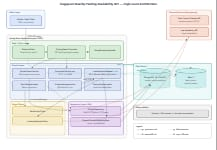
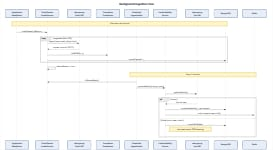
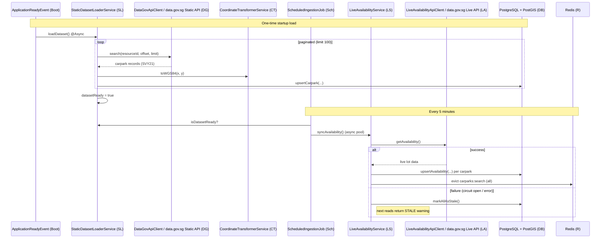

# Singapore Nearby Parking Availability API

A production-grade, resilient Spring Boot backend that helps drivers in Singapore find available car parks near a given GPS location. It ingests HDB carpark metadata from data.gov.sg, synchronizes live lot availability on a schedule, and serves ranked proximity search results backed by PostGIS spatial queries, a Redis cache-aside layer, and Redis token-bucket rate limiting.

- **Search endpoint:** `GET /api/v1/parking/lots/nearby`
- **Stack:** Java 17+, Spring Boot, Spring Data JPA, PostgreSQL 16 + PostGIS, Redis 7, Resilience4j, OpenFeign, Micrometer/Prometheus.

---

## High-Level Architecture



**Key points**

- **Two independent ingestion paths.** Static carpark metadata loads once at startup (`StartupDatasetLoader` -> `StaticDatasetLoaderService`, async and paginated), while live lot availability refreshes every 5 minutes (`ScheduledIngestionJob` -> `LiveAvailabilityService`).
- **Cache-aside on read.** `CarparkSearchService` checks Redis first using a spatially quantized key (~110 m grid at 3-decimal rounding), falling back to a PostGIS proximity query on a miss. Each live sync calls `@CacheEvict` to clear stale search results.
- **Resilience.** The live API call is wrapped in Resilience4j circuit breaker + retry. On failure the fallback marks all availability rows as `STALE`, so the API still responds with a data-freshness warning rather than failing.
- **Rate limiting** runs in a servlet filter before the controller, using an atomic Redis Lua token bucket, and fails open if Redis is unreachable.

---

## User Request Flow (Search Nearby)




---

## Background Ingestion Flow

Rendered diagram (generated from the sequence definition below):


**Participant definitions:**

| Alias | Full name | Description |
| :--- | :--- | :--- |
| `Boot` | `ApplicationReadyEvent` | Spring Boot lifecycle event fired once the application context is fully initialized; `StartupDatasetLoader` listens for it to trigger the one-time static dataset load. |
| `SL` | `StaticDatasetLoaderService` | Service that ingests static carpark metadata from data.gov.sg in paginated batches, converts coordinates, and upserts carpark rows. |
| `DG` | `DataGovApiClient` (data.gov.sg Static API) | Feign client calling the `datastore_search` endpoint that returns HDB carpark records with SVY21 coordinates. |
| `CT` | `CoordinateTransformerService` | Converts SVY21 (EPSG:3414) easting/northing to WGS84 (EPSG:4326) latitude/longitude and validates Singapore bounds. |
| `Sch` | `ScheduledIngestionJob` | `@Scheduled` component that triggers the live availability sync every 5 minutes on a dedicated executor. |
| `LS` | `LiveAvailabilityService` | Service that fetches live lot availability, upserts it, and evicts the search cache; guarded by circuit breaker, retry, and a stale fallback. |
| `LA` | `LiveAvailabilityApiClient` (data.gov.sg Live API) | Feign client calling the `carpark-availability` endpoint that returns real-time lot counts. |
| `DB` | PostgreSQL (+ PostGIS) | Relational store holding the `carparks` and `carpark_current_availability` tables with spatial indexing. |
| `R` | Redis | In-memory store used for the search-result cache and rate-limit token buckets. |

<details>
<summary>Mermaid source</summary>



</details>

---

## Component Overview

| Layer | Component | Responsibility |
| :--- | :--- | :--- |
| Web | `RateLimitFilter` | Per-IP token-bucket rate limiting before the controller; injects `X-RateLimit-*` headers, returns 429 on exhaustion, fails open if Redis is down. |
| Web | `ParkingSearchController` | Validates request params and Singapore bounds; delegates to search service; maps results to `ApiResponse`. |
| Web | `GlobalExceptionHandler` | Central exception-to-HTTP mapping using the `CP-*` error taxonomy. |
| Service | `CarparkSearchService` | Cache-aside proximity search (`@Cacheable`), row mapping to DTOs, pagination, stale-data warnings. |
| Service | `CoordinateTransformerService` | SVY21 (EPSG:3414) to WGS84 conversion and Singapore bounds validation. |
| Service | `LiveAvailabilityService` | Scheduled live availability sync with circuit breaker, retry, and cache eviction; stale fallback. |
| Service | `StaticDatasetLoaderService` | Async paginated ingestion of static carpark metadata at startup. |
| Service | `ScheduledIngestionJob` | Triggers live sync every 5 minutes on a dedicated executor. |
| Client | `DataGovApiClient` / `LiveAvailabilityApiClient` | Feign clients for the two data.gov.sg endpoints. |
| Repository | `CarparkRepository` | PostGIS `ST_DWithin` / `ST_Distance` proximity queries and carpark upserts. |
| Repository | `CarparkCurrentAvailabilityRepository` | Availability upserts and `markAllAsStale`. |
| Data | PostgreSQL + PostGIS | Static metadata and current availability with spatial GiST indexing. |
| Data | Redis | Search-result cache and rate-limit token buckets. |

---

## Running Locally

```bash
docker-compose up --build
```

This starts three services defined in `docker-compose.yml`:

- `app` — the Spring Boot application on port `8080`
- `db` — PostgreSQL 16 + PostGIS
- `redis` — Redis 7 (cache + rate-limit store)

API docs (Swagger UI) are available at `http://localhost:8080/swagger-ui.html`, and metrics at `http://localhost:8080/actuator/prometheus`.

---

## Example Request

```bash
curl "http://localhost:8080/api/v1/parking/lots/nearby?latitude=1.3325&longitude=103.8471&radius=3000&lim…
```

| Param | Range | Default | Description |
| :--- | :--- | :--- | :--- |
| `latitude` | -90 to 90 (must be in SG bounds) | required | WGS84 latitude |
| `longitude` | -180 to 180 (must be in SG bounds) | required | WGS84 longitude |
| `radius` | 100 to 10000 (meters) | 3000 | Search radius |
| `limit` | 1 to 100 | 10 | Page size |
| `page` | >= 0 | 0 | 0-indexed page |
